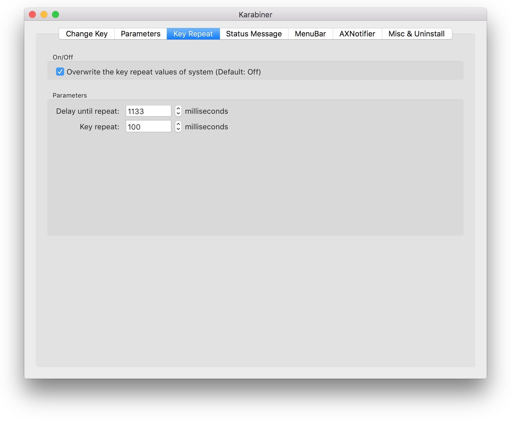
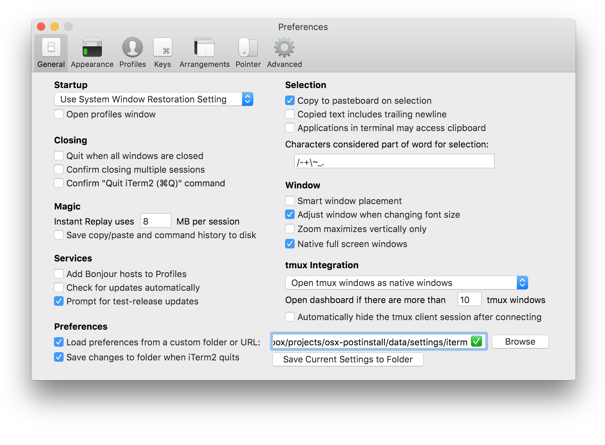

# OSX Postinstall

Set of post-installation scripts for OS X 10.11 (El Capitan)

## About

### The main objective

Script install [BlockBlock](https://objective-see.com/products/blockblock.html) and apply [OS X Lockdown](https://github.com/SummitRoute/osxlockdown) settings (optionally) ***before*** all installations. So, you can control Launch Agents installations with BlockBlock and pray for OSX Lockdown hardening settings, because there is [no](http://www.pcworld.com/article/3035682/security/hackers-planted-a-backdoor-inside-a-compromised-version-of-linux-mint.html) [silver](http://www.macrumors.com/2016/03/07/transmission-malware-downloaded-6500-times/) [bullet](http://arstechnica.com/security/2015/07/how-a-russian-hacker-made-45000-selling-a-zero-day-flash-exploit-to-hacking-team/). Whatever, we will do all possible for it, right?

### Under the hood

- **bin/**:
  + `main.sh` - main script which will run all of them
  + `msf_install.sh` - Metasploit Framework install
  + `osxdefaults.sh` - OSX Defaults setup
  + `osxlockdown.sh` - OSX Lockdown setup
  + `sublime_setup.sh` - ST3 setup
  + `git_install.sh` - install tools from **git-tools** folder (below)
  + `tools_install.sh` - install tools from `tools_list.txt` (below)
- **data/**:
  + **settings/** - ST3, iTerm and Karabiner settings
  + **tools/**:
    * **git-tools/** - set of tools which you want to install via git
    * **git-tools-template/** - template for future git-tools installations
    * `tools_list.txt` - lists of tools which you want to install via brew, brew cask, gem, pip, etc

## Usage

### brew / cask / pip / gem tools

1. Install Xcode via App Store
2. Download [zip archive](https://github.com/yugoslavskiy/osx-postinstall/archive/master.zip) of the repo
3. Unzip it using GUI or `unzip` tool via Terminal.app
4. Edit `data/tools/tools_list.txt` using format that shown below:
  ```bash
$ head  data/tools/tools_list.txt
# each line consist of:
#     - tool:id
# id:
#     0 - brew install
#     1 - brew cask install
#     2 - pip install
#     3 - gem install
#     4 - brew tap
#     5 - vagrant plugin install
#     6 - ln -sfv /usr/local/opt/<tool>/*.plist ~/Library/LaunchAgents
  ```

5. Go to `bin/`, then run `./main.sh --help` and choose available options

### git tools

1. Go to `data/tools/git-tools` folder, and add (using `git-tools-template`) or delete git tools
2. Go to `bin/`, then run `./git_install.sh --help` and choose available options

### other `bin/` scripts

For more info:

- `msf_install.sh --help`
- `cat osxdefaults.sh`
- `cat osxlockdown.sh` (not all options enabled by default! see comments)
- `cat sublime_setup.sh`

## Manual-only installations

### Karabiner

Run Karabiner and set check mark `Overwrite the key repeat values of system`:

After that, run `data/settings/karabiner/karabiner-import.sh`.

### iTerm

Run iTerm, open Preferences and set path to `data/settings/iterm` to `Load preferences from a custom folder of URL` field:

After that, reload iTerm.

### SUIDGuard

Download and install [SUIDGuard](https://github.com/sektioneins/SUIDGuard). (WARNING: [SUIDGuard crashes on 10.11.4 on boot](https://github.com/sektioneins/SUIDGuard/issues/12))

## TO-DO

- Add [osxparanoia](https://github.com/l1k/osxparanoia) stuff
- Porting [osxfortess](https://github.com/essandess/osxfortress) to Homebrew
- Deploy and configure [Splunk](http://www.splunk.com/) + [osquery](https://github.com/facebook/osquery)
